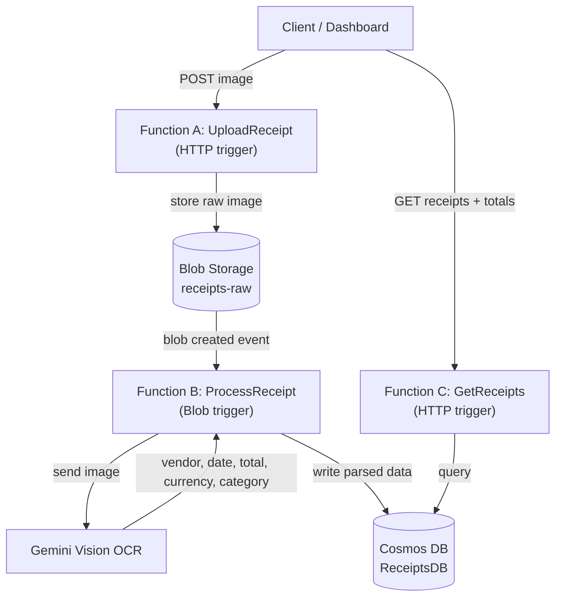
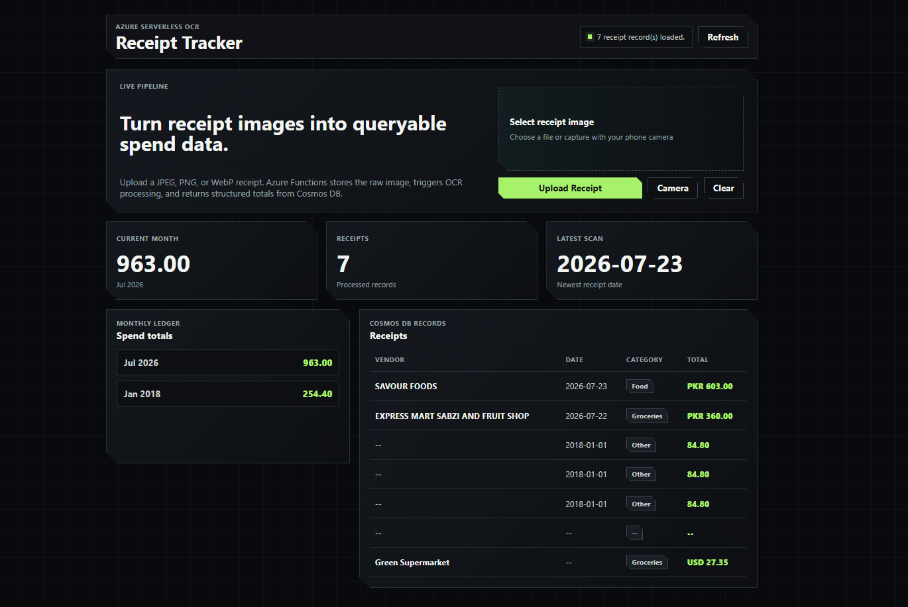

# Receipt Tracker - Serverless OCR Pipeline on Azure

An event-driven serverless app that turns a receipt photo into structured,
searchable data. Upload or capture a receipt image, store it in Blob Storage,
extract `{ vendor, date, total, currency, category }` with an AI vision model,
and save the parsed record in Cosmos DB for dashboard reporting.

Built as a hands-on project while studying for the **Microsoft Azure Developer
Associate (AZ-204)** certification.

**Live demo:** https://kind-island-03410b21e.7.azurestaticapps.net


## Architecture



**Flow:** upload -> store -> OCR -> persist -> query. The image upload returns
quickly, then receipt processing happens asynchronously from the Blob trigger.

---
## Dashboard Preview



Deployed flow: Static Web Apps -> Function App -> Blob Storage -> Blob trigger
-> Gemini Vision -> Cosmos DB.

---
## Tech Stack

| Layer | Technology |
|-------|------------|
| Compute | Azure Functions (Node.js / TypeScript, v4 model) |
| Storage | Azure Blob Storage |
| Database | Azure Cosmos DB for NoSQL |
| AI / OCR | Gemini Vision |
| Frontend hosting | Azure Static Web Apps |
| Frontend | Plain HTML, CSS, and JavaScript |
| CI/CD | GitHub Actions |
| Local storage emulator | Azurite |
| Planned security | Azure Key Vault + Managed Identity |
| Planned monitoring | Application Insights |

---

## Features

- Image upload API with content-type validation for JPEG, PNG, and WebP.
- Mobile camera capture from the frontend using `capture="environment"`.
- Raw receipt images stored in Blob Storage under a user-prefixed path.
- Automatic OCR processing when a new blob is created.
- Structured receipt records stored in Cosmos DB.
- Partition-scoped Cosmos query by `userId`.
- Sharp fintech-style dashboard with monthly totals, receipt metrics, status
  states, and responsive mobile layout.
- Static frontend deployed through Azure Static Web Apps and GitHub Actions.

---

## Project Structure

```text
receipt-tracker/
  frontend/
    index.html      # Dashboard structure
    styles.css      # Sharp fintech visual system
    app.js          # Upload, camera capture, API calls, and rendering
  src/
    functions/
      UploadReceipt.ts
      ProcessReceipt.ts
      GetReceipts.ts
    shared/
      cosmos.ts
      gemini.ts
```

---

## Run Locally

**Prerequisites:** Node.js 20+, Azure Functions Core Tools v4, and
[Azurite](https://learn.microsoft.com/azure/storage/common/storage-use-azurite).

```bash
# 1. Go to the Functions project
cd receipt-tracker

# 2. Install dependencies
npm install

# 3. Start Azurite in a separate terminal
npx azurite --skipApiVersionCheck

# 4. Start the Functions host
npm start
```

Create `local.settings.json` in `receipt-tracker/` for local development. This
file is git-ignored and must not be committed.

```json
{
  "IsEncrypted": false,
  "Values": {
    "AzureWebJobsStorage": "UseDevelopmentStorage=true",
    "FUNCTIONS_WORKER_RUNTIME": "node",
    "COSMOS_CONNECTION": "<your-cosmos-connection-string>",
    "GEMINI_KEY": "<your-gemini-api-key>"
  }
}
```

### Test the upload endpoint

```bash
curl -X POST "http://localhost:7071/api/UploadReceipt" \
  -H "Content-Type: image/jpeg" \
  --data-binary "@receipt.jpg"
```

Example response:

```json
{
  "message": "Receipt uploaded.",
  "blob": "demo-user/1784730953476-e434adcf.jpg",
  "size": 1243867
}
```

### Frontend deployment

The Static Web Apps workflow deploys files from `frontend/` on pushes to
`main`:

```text
receipt-tracker/frontend/index.html
receipt-tracker/frontend/styles.css
receipt-tracker/frontend/app.js
```

After changing the UI, commit and push to `main`; GitHub Actions will redeploy
the Static Web App automatically.

---

## Roadmap

| Phase | Scope | Status |
|-------|-------|--------|
| 1 | Project setup, scaffold, Cosmos DB | Done |
| 2a | `UploadReceipt` - HTTP to Blob Storage | Done |
| 2b | `ProcessReceipt` - Blob trigger to Gemini OCR to Cosmos DB | Done |
| 3 | `GetReceipts` query API + Static Web Apps dashboard | Done |
| 3b | Sharp frontend redesign + mobile camera upload | Done |
| 4a | Deploy Function App + Storage to Azure | Done |
| 4b | Deploy dashboard to Static Web Apps with GitHub Actions | Done |
| 4c | Key Vault + Managed Identity | Done |
| 5 | Application Insights monitoring | Planned |

---

## What I Am Learning

This project maps well to AZ-204 objectives:

- **Develop Azure compute solutions:** Azure Functions with HTTP and Blob
  triggers.
- **Develop for Azure storage:** Blob Storage for raw images and Cosmos DB for
  structured JSON documents.
- **Implement Azure security:** app settings now, Key Vault and Managed Identity
  planned.
- **Monitor and optimize:** Application Insights planned for logs, failures,
  dependency calls, and latency.
- **Connect to and consume Azure services:** event-driven processing across
  Static Web Apps, Functions, Storage, AI, and Cosmos DB.

---

