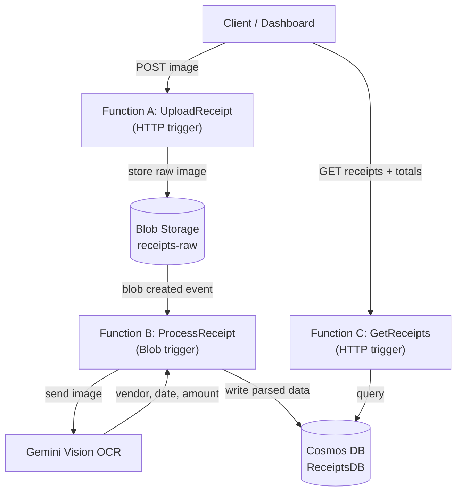

# 🧾 Receipt Tracker — Serverless OCR Pipeline on Azure

An event-driven serverless app that turns a photo of a receipt into structured, searchable data. Upload a receipt image → it's stored, read by an AI vision model, parsed into `{ vendor, date, amount }`, and saved to a database with a dashboard showing monthly totals.

Built as a hands-on project while studying for the **Microsoft Azure Developer Associate (AZ-204)** certification 

---

## Architecture



**Flow:** upload → store → OCR → persist → query. Fully serverless, event-driven, no always-on servers.

---

## Tech Stack

| Layer | Technology |
|-------|-----------|
| Compute | Azure Functions (Node.js / TypeScript, v4 model) |
| Storage | Azure Blob Storage |
| Database | Azure Cosmos DB (NoSQL) |
| AI / OCR | Gemini Vision |
| Secrets | Azure Key Vault + Managed Identity *(Phase 4)* |
| Monitoring | Application Insights *(Phase 5)* |
| Frontend | Azure Static Web Apps *(Phase 3)* |
| Local dev | Azurite (Blob emulator), Functions Core Tools |

---

## Features

- ✅ Image upload API with content-type validation (JPEG / PNG / WebP)
- ✅ Raw images stored in Blob Storage, partitioned by user
- 🚧 Automatic OCR extraction on upload (Blob trigger → Gemini)
- 🚧 Structured receipt storage in Cosmos DB
- 🚧 Query API + dashboard with monthly totals
- 🚧 Secrets secured via Key Vault + Managed Identity
- 🚧 Telemetry via Application Insights

---

## Run Locally

**Prerequisites:** Node.js 20+, Azure Functions Core Tools v4, [Azurite](https://learn.microsoft.com/azure/storage/common/storage-use-azurite).

```bash
# 1. Install dependencies
npm install

# 2. Start Azurite (local Blob Storage emulator) — keep this terminal open
npx azurite --skipApiVersionCheck

# 3. In a second terminal, start the Functions host
npm start
```

Create a `local.settings.json` (git-ignored — never committed):

```json
{
  "IsEncrypted": false,
  "Values": {
    "AzureWebJobsStorage": "UseDevelopmentStorage=true",
    "FUNCTIONS_WORKER_RUNTIME": "node",
    "COSMOS_CONNECTION": "<your-cosmos-connection-string>",
    "GEMINI_KEY": "<your-gemini-api-key>"
  }
}
```

### Test the upload endpoint

```bash
curl -X POST "http://localhost:7071/api/UploadReceipt" \
  -H "Content-Type: image/jpeg" \
  --data-binary "@receipt.jpg"
```

Response:

```json
{
  "message": "Receipt uploaded.",
  "blob": "demo-user/1784730953476-e434adcf.jpg",
  "size": 1243867
}
```

---

## Roadmap

| Phase | Scope | Status |
|-------|-------|--------|
| 1 | Project setup, scaffold, Cosmos DB | ✅ Done |
| 2a | `UploadReceipt` — HTTP → Blob Storage | ✅ Done |
| 2b | `ProcessReceipt` — Blob trigger → Gemini OCR → Cosmos | 🚧 Next |
| 3 | `GetReceipts` query API + Static Web App dashboard | ⬜ Planned |
| 4 | Deploy to Azure, Key Vault + Managed Identity | ⬜ Planned |
| 5 | Application Insights monitoring | ⬜ Planned |

---

## What I'm Learning

This project is a practical companion to the AZ-204 exam objectives:

- **Develop Azure compute solutions** — Functions (HTTP + Blob triggers)
- **Develop for Azure storage** — Blob Storage, Cosmos DB
- **Implement Azure security** — Key Vault, Managed Identity
- **Monitor and optimize** — Application Insights
- **Connect to and consume Azure services** — event-driven Blob triggers

